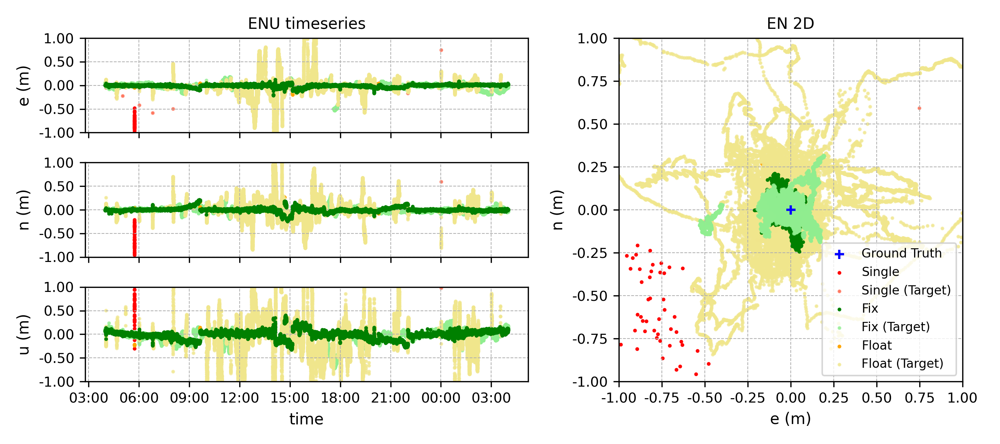

一昨日、MRTKLIB `v0.6.14` をリリースしました。

[Release Notes — v0.6.14](https://h-shiono.github.io/MRTKLIB/releases/release-notes-v0.6.14/)

今回のリリースでは主に CLAS のリアルタイム処理周りの改善を行いました。

## 補強衛星切り替えバグの修正

`mrtk run` にて、補強衛星切り替え時に測位品質が単独測位に落ちて戻らないバグがありました。
補強衛星の切り替えは主に衛星仰角が閾値以下まで下がった場合に発生します。
`v0.6.14` ではこれを解消し、補強衛星が切り替わっても単独測位には落ちず、PPP-RTK が継続できるようになりました。

この修正に伴い、[CLAS Live ダッシュボード](https://live.pntmoni.com/)を再開しました。
このバグの他にも補強情報ストリームの安定性などの問題があったため、しばらく運用を停止していましたが、安定運用の見込みがたったため再開しました。

再開にあたっては、今までのグローバル IP アドレスでの公開から専用ドメイン (`pntmoni.com`) での公開に切り替えました。
PNT Moni プロジェクトについては、また時期を見てご紹介したいと思います。

## cssr2rtcm3 の精度改善

`cssr2rtcm3` はリアルタイムに QZSS CLAS CSSR を RTCM3 に変換するための機能です。
この機能を活用することで、「L6 は受信できるけど CLAS 測位には対応していない」という受信機を使って CLAS 測位ができるようになります[^1]。

[^1]: Zenn, [L6対応受信機を CLAS 測位対応にする — MRTKLIB v0.6.5 と小型端末レシピ](https://zenn.dev/hatognss/articles/3c102a051af51d)

しかしながら、性能面では依然課題が残っており、24時間のテストでは Fix 率 **72.05%** に留まっていました[^2]。

[^2]: MRTKLIB Documentation, CLAS Positioning with Septentrio mosaic-G5, [Long-term stability (24 h)](https://h-shiono.github.io/MRTKLIB/hardware/cssr2rtcm3-mosaic-g5/#long-term-stability-24-h)

今回、精度劣化の一因を突き止めることができ、修正を行いました。

1. 位相バイアスのラップ補正（±100周期）の取りこぼし修正 (#97, #207)
2. Galileo E5a の OSR 変換時のグリッチ（跳び）の解消 (#98, #208)
3. 有効な OSR 観測量が出力されていない衛星のマスキング

現在、連続稼働試験を行なっており、完了次第ご報告いたします。
なお、短時間の結果では上記の修正によって測位が不安定になって一時的に Float に落ちても短時間で Fix に復帰することを確認しています。

**2026-06-15 追記**

24時間連続稼働試験の結果を以下に示します。

| Engine | 水平精度 cm (95%) | 垂直精度 cm (95%) | Fix 率 |
| --- | --- | --- | --- |
| cssr2rtcm3 | 59.79 | 51.81 | **61.49** |
| mrtk run | 12.08 | 10.20 | **99.62** |

今回の試験では `cssr2rtcm3` の Fix 率が **61.49%** と、前回の **72.05%** より低下したように見えます。
しかしながら、前回の試験は5月9日でまだ電離圏が静穏な時期だったので、単純な比較はあまり意味がありません[^3]。

[^3]: NICT, Quasi-realtime detrended TEC map (15-min window)
9 May 2026 (129_2026), https://aer-nc-web.nict.go.jp/GPS/QR_GEONET/MAP15/2026/129/index.html

今回の試験は6月14日から15日にかけて実施しました。
この時期は夜間に MSTID が発生することが多く、このタイミングでも発生していることが確認できました[^4]。
この MSTID の発生タイミングと、両エンジンに共通して見られる精度劣化のタイミング（UT12\:00~18\:00 頃）が一致していることがわかります。

[^4]: NICT, Quasi-realtime detrended TEC map (15-min window)
14 Jun 2026 (165_2026), https://aer-nc-web.nict.go.jp/GPS/QR_GEONET/MAP15/2026/165/index.html

実は6月12日にも24時間試験を行なっており、その時には Fix 率が **87.6%** でした[^5]。
MSTID の発生はあったものの、6月14日に比べると小規模でした[^6]。
したがって、より公平な比較に近いのは6月12日の結果ということになり、改善の効果が出ていると考えてよいでしょう。

[^5]: GitHub Issue, https://github.com/h-shiono/MRTKLIB/issues/98#issuecomment-4697049059
[^6]: NICT, Quasi-realtime detrended TEC map (15-min window) 12 Jun 2026 (163_2026), https://aer-nc-web.nict.go.jp/GPS/QR_GEONET/MAP15/2026/163/index.html

`mrtk run` についても、電離圏擾乱下で Fix 率 **99.62%** かつ精度も安定しているのは、**v0.6.13** の改善が効いていると見て良さそうです。

---

最近時間が取れず紹介記事を書けていないのですが、他にもバグフィックス等改善を実施しています。

| Version | 主な変更内容 |
| :---: | --- |
| **v0.6.10** | 単独測位の精度向上 ([#116](https://github.com/h-shiono/MRTKLIB/issues/116))、[ベンチマーク](https://h-shiono.github.io/MRTKLIB/reference/benchmark/#v0610-single-point-positioning-spp-benchmark-results)にて **\<2 m の割合 +20 pp, Median -50 %, 95% -30 %, RMS -56 %** の大幅な改善の達成 |
| **v0.6.11** | CI の改善 ([#166](https://github.com/h-shiono/MRTKLIB/issues/166)、[#175](https://github.com/h-shiono/MRTKLIB/issues/175))、Google Smartphone Decimeter Challenge ベンチマークの追加 ([#165](https://github.com/h-shiono/MRTKLIB/issues/165)) |
| **v0.6.12** | Realtime MADOCA-PPP の信号選択バグ解消 ([#183](https://github.com/h-shiono/MRTKLIB/issues/183)、および関連チケット) |
| **v0.6.13** | CLAS PPP-RTK で用いる単独測位解のロバスト性向上 (`v0.6.10` の PPP-RTK への適用) |
| **v0.6.14** | CLAS PPP-RTK のリアルタイム処理周りの改善（上述）、単一 COM ポートでの双方向運用（`mrtk relay -b`）の手順を整備 ([#117](https://github.com/h-shiono/MRTKLIB/issues/117)) |

`v0.6.10` の単独測位の精度向上 ([#116](https://github.com/h-shiono/MRTKLIB/issues/116))、`v0.6.14` の単一 COM ポートでの双方向運用（`mrtk relay -b`）の手順を整備 ([#117](https://github.com/h-shiono/MRTKLIB/issues/117)) については[全国大会](/blog/2026-05-ipntj-reflection/)にていただいたフィードバックを基に実現した改善です。
また、`v0.6.12` の Realtime MADOCA-PPP の信号選択バグ解消 ([#183](https://github.com/h-shiono/MRTKLIB/issues/183)) についてもバグレポートをいただいた結果、修正することができました。

このように、皆様からのバグレポートは MRTKLIB の開発・品質向上において大変貴重です。
些細なことでも良いので、不具合を見つけたらご一報いただけますと幸いです。
